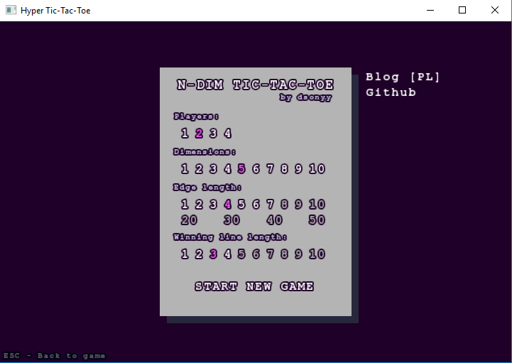
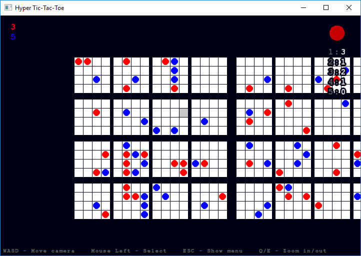
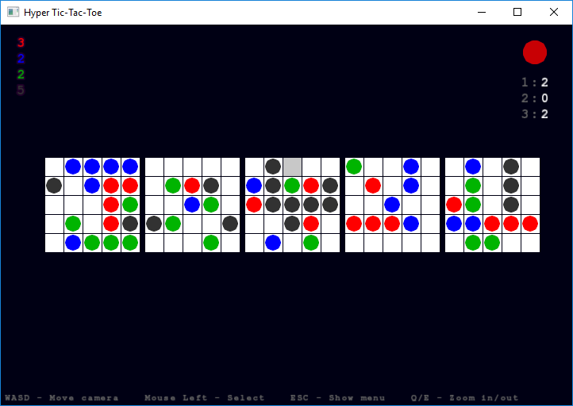
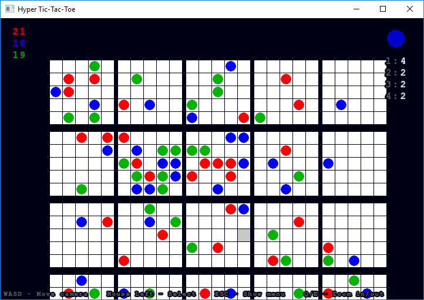
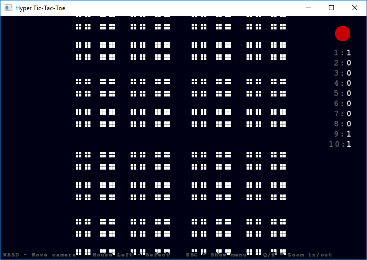
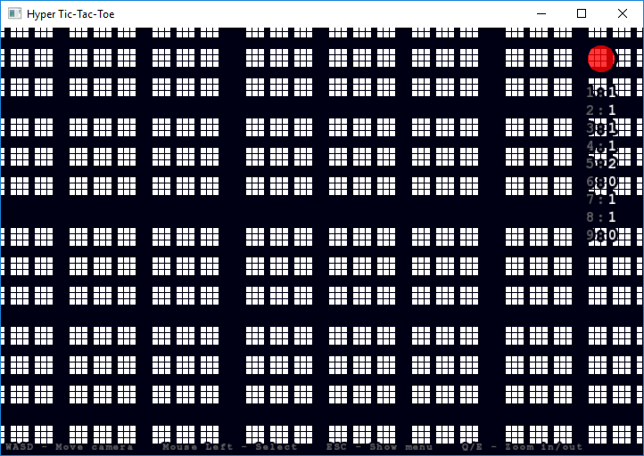
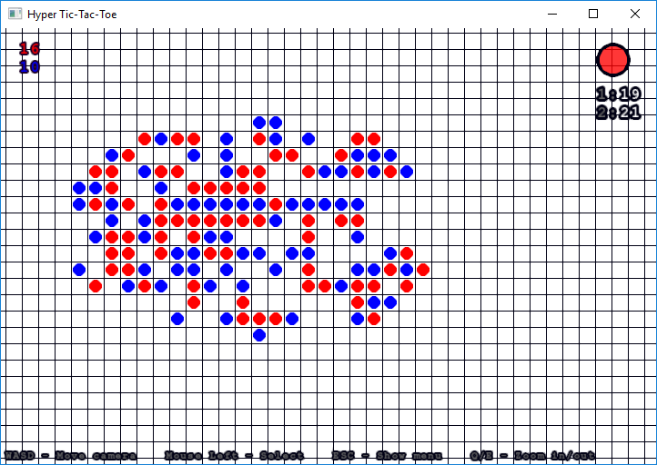
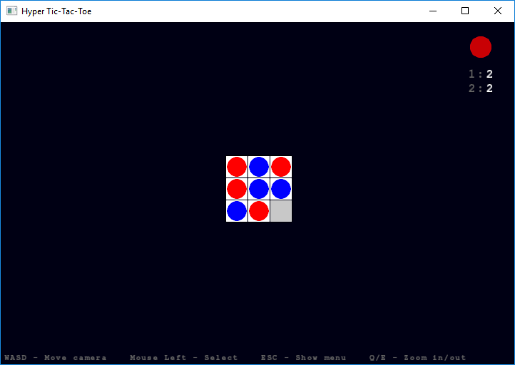

# N-Dimensional Tic-Tac-Toe
Play in tic-tac-toe on the n-dimensional board (2D, 3D, 4D, ... nD).

## Instalation
1. Download SFML 2.5 (32 bits) and extract it to the "SFML" directory in the main repository.
2. Open the solution file in Visual Studio.
3. Compile and run.

## Screenshots

N-Dimensional Tic-Tac-Toe welcomes in main menu:

  

5 Dimensions with 4 edge length:

  

Invite more friends! There's enough space for 4 players:

  

4 Dimensions, 5 edge length and 3 players:

  

Unplayable 10 dimensions, 2 edge length (it's funny because wherever you click, you will always score a point)

9 dimensions, 3 edge length but it's still hard to play:

2 Dimensions with a huuuge board:

Maybe something more traditional?

